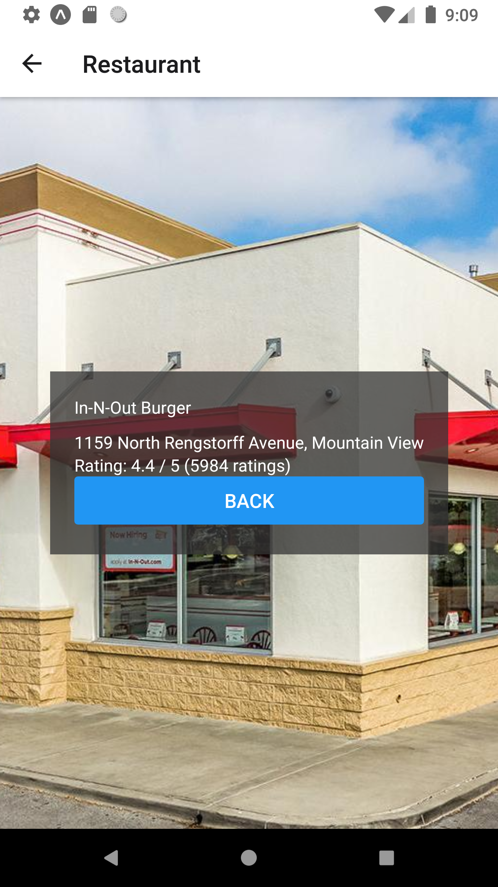

LunchMe
=============

This project was bootstrapped with [Create React Native App](https://github.com/react-community/create-react-native-app).

LunchMe is a mobile application which randomly displays a nearby restaurant for you to have lunch. The app uses Google's Nearby Search API for restaurant detection. 

## Screenshots

### Main Screen

### Restaurant Screen

